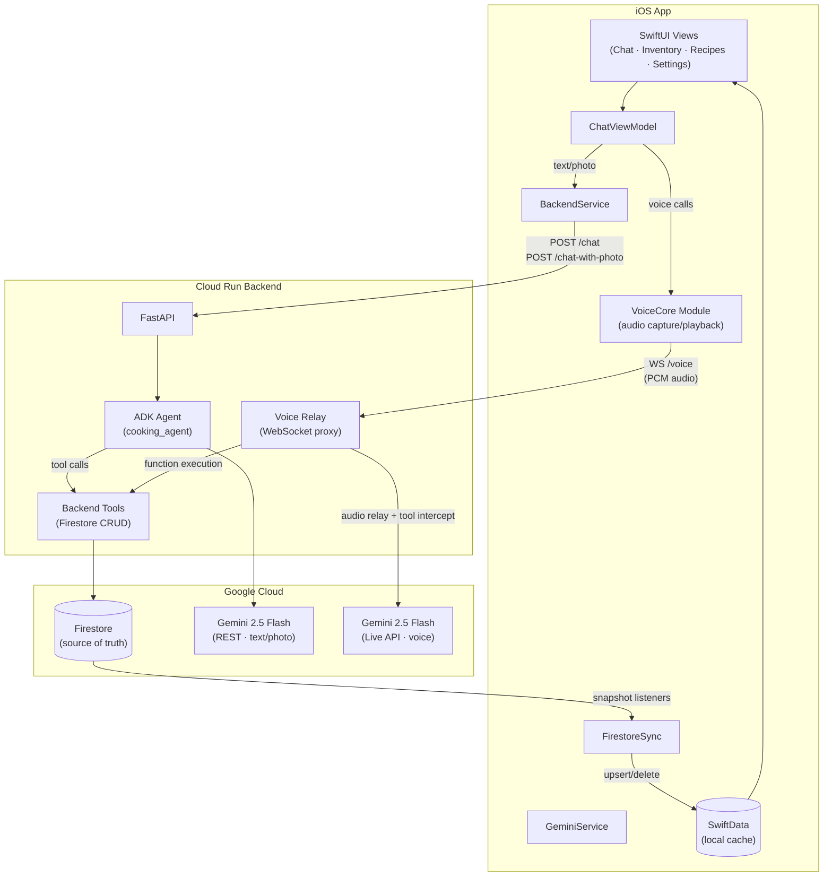

# Heard, Chef


> **"Heard, chef!"** - this AI definitely will not say "you're absolutely right!"

## Overview

"Heard, Chef" is a native iOS cooking assistant powered by Gemini, with persistent memory backed by Firestore. It combines an iMessage-style chat interface with a hands-free voice mode, letting you manage inventory, plan meals, and get real-time cooking feedback without washing your hands.

The system is three pieces: a **SwiftUI iOS app**, a **Python FastAPI backend** on Cloud Run, and **Firestore** as the shared database. The AI layer is Gemini 2.5 Flash for text/photo and Gemini 2.5 Flash Native Audio for voice.

## The Experience

### Conversational Core

The app is built around a familiar, iMessage-style chat interface.

- **Natural Texting:** Text your chef just like a friend. "Do I have enough eggs for a quiche?" or "Remind me to buy basil."
- **Media Rich:** Snap photos directly in the chat flow to ask questions or log items.
- **Live Tool Chips:** Watch the AI "think" and work. When you ask to check the pantry, a chip pops up showing `Checking Inventory...` followed by `Found: 6 Eggs`.

### Live Voice Mode

Tap the microphone for a hands-free experience designed for active cooking.

- **The 40% Modal:** Voice mode slides up a sheet covering the bottom 40% of the screen.
- **Chef Avatar:** An animated avatar provides visual feedback, reacting to your voice and the AI's processing state.
- **Background Context:** The chat window and tool chips remain visible behind the modal, so you can confirm that the AI added "Paprika" to your list even while it keeps talking.

### Visual Intelligence

Use the camera to bridge the physical and digital kitchen.

- **Receipt Scanning:** Snap a photo of a grocery receipt. The AI parses the items, normalizes quantities (e.g., "2 lbs" instead of "bag"), and adds them to your inventory.
- **Cooking Feedback:** Unsure if your onions are caramelized enough? Snap a photo and ask, "Is this ready?"

### Persistent Memory

What sets this apart from generic AI chat is that your data lives across sessions in Firestore.

- **Allergy awareness:** The system prompt includes your dietary restrictions so recipes are always adjusted.
- **Recipe book:** Find, save, edit, and share recipes. The recipe book can be referenced while shopping or cooking.
- **Inventory tracking:** Know what you already have at home while you're at the store.

## Technical Architecture

### System Overview



### How It Fits Together

**iOS app** (`app/`) — SwiftUI front-end with four tabs: Inventory, Chat, Recipes, Settings. `GeminiService` is the main integration point, routing text and photo chat through `BackendService` (REST) and voice calls through a WebSocket relay. `FirestoreSync` listens for Firestore changes and writes them into a local SwiftData cache so the UI stays responsive offline.

**Cloud Run backend** (`backend/`) — A Python FastAPI server using Google's Agent Development Kit (ADK). It exposes three endpoints: `POST /chat` for text, `POST /chat-with-photo` for multimodal, and `WS /voice` for bidirectional audio relay. Tool calls (add ingredient, create recipe, etc.) are executed server-side against Firestore.

**Firestore** — Source of truth for all user data. Structured as `users/{userId}/ingredients/{docId}` and `users/{userId}/recipes/{docId}`. The iOS app never writes to Firestore directly; all mutations go through the backend's tool execution.

**VoiceCore module** (`Modules/VoiceCore/`) — Extracted subsystem owning voice/call coordination, audio capture/playback, route recovery, and the call state machine. Keeps voice complexity out of the main app layer.

### Tool Calling

Instead of dumping inventory into the prompt, the AI calls specific tools to retrieve and mutate data on demand. Tool calls are executed server-side against Firestore.

| Domain         | Function                      | Description                                 |
| -------------- | ----------------------------- | ------------------------------------------- |
| **Inventory**  | `add_ingredient`              | Add items with quantity normalization       |
|                | `remove_ingredient`           | Decrement stock or remove items             |
|                | `update_ingredient`           | Patch ingredient fields                     |
|                | `get_ingredient`              | Check details for one ingredient            |
|                | `list_ingredients`            | List items with optional filters            |
|                | `search_ingredients`          | Fuzzy name search                           |
| **Recipes**    | `create_recipe`               | Create a new recipe                         |
|                | `update_recipe`               | Update recipe fields                        |
|                | `delete_recipe`               | Remove a recipe                             |
|                | `get_recipe`                  | Full recipe with ingredients and steps      |
|                | `list_recipes`                | Browse recipes by tag                       |
|                | `search_recipes`              | Search by name or tag                       |
| **Cross-Tool** | `suggest_recipes`             | Recipes matching current inventory          |
|                | `check_recipe_availability`   | Missing list for a specific recipe          |

### Testing

Tests are split across three surfaces with stable and experimental lanes. See [Running Tests](#3-running-tests) for commands.

| Surface | Location | What it covers |
| --- | --- | --- |
| `VoiceCoreTests` | `Modules/VoiceCore/Tests/VoiceCoreTests/` | Voice coordination, state machine, audio policy |
| `heardTests` | `heardTests/` | App-host smoke checks, hosted config validation |
| `heardUITests` | `heardUITests/` | Simulator-driven CRUD, navigation, search regressions |

Non-UI tests use Swift Testing. UI tests and `measure`-based performance tests use XCTest.

Full testing reference: [docs/testing/ios-testing-playbook.md](docs/testing/ios-testing-playbook.md)

## Setup & Requirements

### Prerequisites

- **Xcode 17.x** with the Apple Swift 6.2 toolchain
- **Deployment target:** iOS 17.0+
- **Python 3.11+** (for the backend)
- **jq** (`brew install jq`) — required by the test runner for result parsing
- **API Key:** Google Gemini API Key (multimodal live access)

### 1. Clone & iOS Setup

```bash
git clone https://github.com/asavschaeffer/heard-iOS.git
cd heard-iOS
```

Create the API key config (the Xcode project references this file):

```bash
cat > app/Secrets.xcconfig <<'EOF'
GEMINI_API_KEY = your_actual_key_here
EOF
```

Build and run:

```bash
xcodebuild -project app/HeardChef.xcodeproj -scheme heard \
  -destination 'platform=iOS Simulator,name=iPhone 17 Pro' build
```

The test script will create a stub `app/Secrets.xcconfig` automatically if one doesn't exist, so tests can run without a real API key.

### 2. Backend Setup

The Cloud Run backend handles all chat (text, photo, and voice). The ADK agent manages tool calling and Firestore mutations server-side.

```bash
cd backend
pip install -r requirements.txt

# Set your Gemini API key
export GEMINI_API_KEY=your_actual_key_here

# Run locally on port 8080
uvicorn main:app --reload --port 8080
```

The iOS app reads `BACKEND_URL` from `app/Secrets.xcconfig` (defaults to `http://localhost:8080`).

**CI/CD:** Pushes to `master` that change files in `backend/` automatically deploy to Cloud Run via GitHub Actions (`.github/workflows/deploy-backend.yml`). This requires a `GCP_SA_KEY` repository secret containing a service account JSON key with Cloud Run and Secret Manager access.

### 3. Running Tests

The test runner auto-resolves the best available iPhone simulator (prefers iPhone 17 Pro / iOS 26.2).

```bash
# Quick verification — module tests only (~15s)
./scripts/test-ios.sh voicecore

# Build check — confirms the app compiles
./scripts/test-ios.sh app-build

# Smoke tests — app-hosted sanity checks (~90s)
./scripts/test-ios.sh app-smoke

# UI tests — simulator-driven interaction regressions
./scripts/test-ios.sh app-ui

# Full stable gate — all of the above
./scripts/test-ios.sh stable
```

After any run, inspect results with:

```bash
./scripts/xcresult-summary.sh --latest-run
```

See [docs/testing/ios-testing-playbook.md](docs/testing/ios-testing-playbook.md) for the full testing reference (experimental lanes, environment variables, failure triage).

### 4. Configuration & Customization

- **Voice Persona:** Change the voice in `GeminiService.swift`. Supported voices include: `Aoede`, `Charon`, `Fenrir`, `Kore`, and `Puck`.
- **System Prompt:** Customize the chef's personality (e.g., "Gordon Ramsay mode" vs "Grandma mode") in `ChefIntelligence.swift`.

## Todo

**v1.3.0 — Done**
- [x] First-action lag (phone button, long-hold message, share button)*
  - *Still intermittently present — see [#4](https://github.com/asavschaeffer/heard-iOS/issues/4)*
- [x] Keyboard dismiss in add/edit ingredients and edit recipe modals
- [x] Speakerphone echo with Google Live API (VAD tuning + AEC)
- [x] Nav order: Inventory → Chat → Recipes → Settings
- [x] Launch screen dark mode (backgroundless logo)
- [x] Chat bubble color dynamism on light mode
- [x] Chef avatar in chat view, calling, and FaceTime
- [x] VoiceCore module extraction with explicit state machine
- [x] Voice selection and VAD calibration settings
- [x] Beta system prompt editing
- [x] App icon refresh
- [x] Fix ingredients page camera
- [x] Test infrastructure (test plans, VoiceCoreTests, UI regression suite, xcresult diagnostics)
- [x] Google Cloud backend

**UX**
- [ ] Shopping list UI

**New Tools**
- [ ] Allergies
- [ ] Timer tool
- [ ] Unit conversion tool

**Major Features**
- [ ] Multiple chats
- [ ] Auth & ephemeral keys
- [ ] Onboarding
- [ ] Memory manager (post-conversation topic extraction and context assembly)

**Ongoing**
- [ ] Speakerphone echo refinement (VAD tuning, AEC)
- [ ] System prompt experimentation

## Specs

- `docs/gemini-tools.md` - Toolset and Gemini tool architecture
- `docs/testing/ios-testing-playbook.md` - Local verification commands and test ownership
- `docs/testing/testing-strategy.md` - Test layer philosophy and ownership rules
- `docs/architecture/repo-structure-roadmap.md` - Module/app ownership and extraction direction
- `docs/rebuild/04-voice-regression-matrix.md` - Physical-device checklist for voice and attachment regressions
- `docs/compendium/` - Culinary reference knowledge base (ingredients, techniques, books)

## Known Limitations

- **Single user** - No authentication; all data stored under a default user ID
- **Live API experimental** - Gemini Live API may change
- **iOS only** - No macOS/watchOS support
- **English only** - No localization yet
- **No offline mode** - Voice features require internet

## Future Ideas

- [ ] Meal planning calendar
- [ ] Nutritional information
- [ ] Recipe import from URLs
- [ ] Apple Watch companion (timer controls)
- [ ] Siri Shortcuts integration
- [ ] Widget for expiring ingredients

## License

**GNU Affero General Public License v3.0 with Commons Clause**

This program is free software: you can redistribute it and/or modify it under the terms of the GNU Affero General Public License as published by the Free Software Foundation, either version 3 of the License, or (at your option) any later version.

**Commons Clause**
The Software is provided to you by the Licensor under the License, as amended by the "Commons Clause". You may not sell the Software. "Selling" means practicing any or all of the rights granted to you under the License to provide to third parties, for a fee or other consideration (including without limitation fees for hosting or consulting/ support services related to the Software), a product or service whose value derives, entirely or substantially, from the functionality of the Software.

## Acknowledgments

- [Google Gemini API](https://ai.google.dev/) for the underlying intelligence.
- Chef Rah Shabazz - a maverick.
